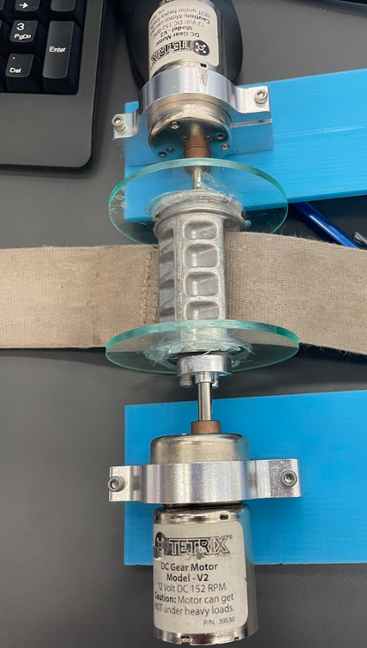
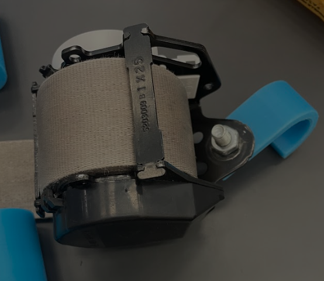
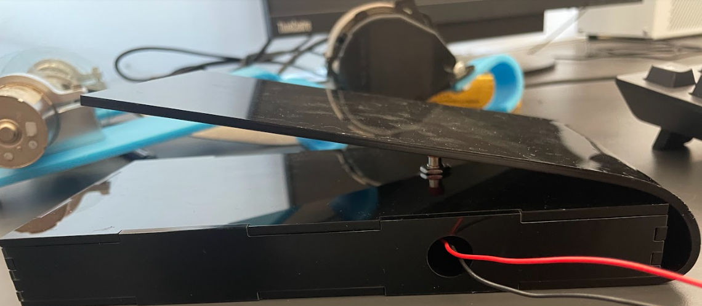
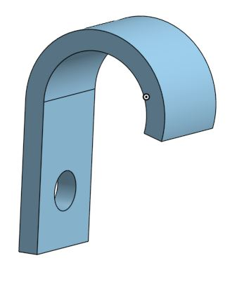
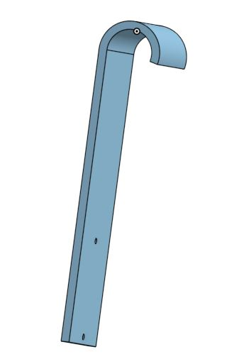
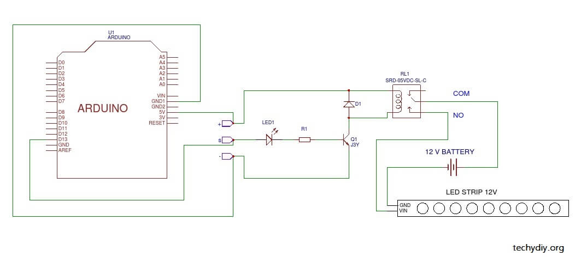
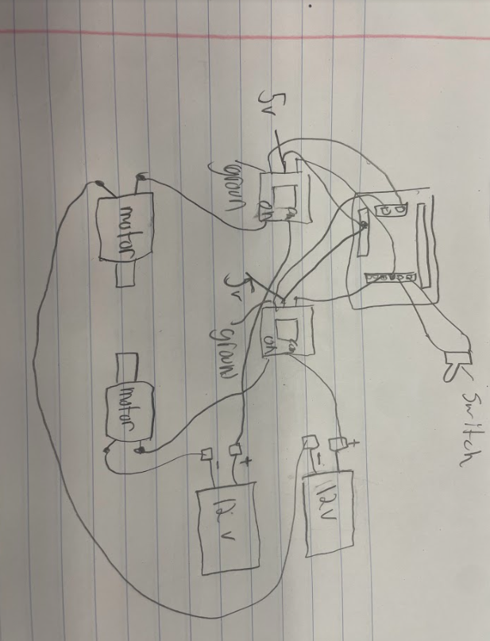

# BenchPressSpotter

## Planning

[This is our planning document](https://docs.google.com/document/d/13RjaRSH5pWMvB6D0o1lA_RDuDaTp80AB6IlN37TVm_s/edit?usp=sharing) 

## Description

Our goal for this project is to create a bench press spotting machine that allows someone to re rack a failed rep by assisting with 20+ lbs of load. The problem we are trying to solve is the danger of not having a spotter when going for a 1 rep max.

## Criteria
1. Finish by deadline
2. Use servo/ robot arm
3. Use metroboard
## Constraints
1. 100$ limit
2. Constraint of our own knowledge
## Solutions
Solution #1: Two simple articulated arms that would pick up bar and rerack it. The advantages of this desgin are that it would be simple to make the arms able to move the bar in a way that it could rerack it, however, two arms could not handle the load of the bar and that is why we didn't do this idea.

Solution #2: Servo controlled pulley system. THis idea was to make a pulley system that could move the bar up. The advatages of this idea are that it would be able to handle the load of the bar, the disadvantages of this idea are that it can't retract when sucesfully completing a rep.

Final Solutiion: 
## List of matierals

-1 Adafruit Metro Express Board 

-1 DFRobot Backpack 

-2 Keyes_SR1y relay module 

-2 12V Tetrix DC Gear Motor Model V2 

-2 12V batteries 

-2 3D-Printed Motor hooks 

-1 3D-Printed Seatbelt hook 

-2 Seatbelt 

-1 Rope 

-1 Button 

-2 Motor Clamps 

-1 9V battery 

-1 Laser-Cut Foot Pedal 

-A lot of Alligator Clips and wires

## Schedule and delegation of work

## Code

```python

import board
import time
import digitalio
led = digitalio.DigitalInOut(board.D3) # led is not a led by relay, code mirrored led code so that is why that is what the variable is called
led.direction = digitalio.Direction.OUTPUT

button = digitalio.DigitalInOut(board.D7) # creating button variable
button.direction = digitalio.Direction.INPUT
button.pull = digitalio.Pull.UP

while True:
    if button.value is False: # if button pressed, turn relay on 
        led.value = True
        print("engaged")
        time.sleep(0.1)
    else:
        led.value = False # if not then turn relay off 
        print("disengaged")
        time.sleep(0.1)
```

The code for this project was very simple compared to the mechanical side of it, all the code does is turn on the relay when button is pressed, and when button is not pressed relay is off.

## Evidence

https://user-images.githubusercontent.com/71349670/171199708-31514010-6b1a-464e-92c0-694f5d2c34ee.mp4

Video of working finished project


Motor barrel 


seatbelt we used


footpedal we used as our switch


The hook used to hold the seatbelt up


The hook used to hold the motors up

## Wiring





The first picture shows a wiring diagram simalair to ours as it uses a relay, battery, and some output, our actual wiring differs in that it uses two relays, as well as two motors. Also the only the ON part of our relay connects to the motor, and the COM part goes to the battery. We also used a switch where one side attathces to the board, in the same row as on of the relay pins, and one side attachtes to pin 7 on the metro board.

## Reflection

The main part of the project that took us the longest was picking a design, and building. We went through many rought drafts of design that included a servo contorlled pulley system and a two servo arms that would lift the bar. The problem we ran into was we needed whatever was attached to the bar to retract on the way up instead of leaving slack, this led us to a seat belt. The other main problem was we needed motors that could carry enoough load to make the project effective. We used two Tetrix 12v motors for this. The next problem we had was attaching the motor and seatbelt configuration to the bench rack, to do this we attatched hooks to our design and put them on the bar on top of the bench. Another thing we had to do was figure out a way to attatch the motor to a working setabelt system, instead of trying to do this, we attached the motors to a sepreate barrel below the seatbelt configuration. This would catch the seat belth and bring it back up. This design allowed us to not mess with the seatbelt configuration Origanally our wiring only had a switch, batteries, and the motors, but then our circuit caught on fire. We needed relays so 12 vs could get to the motor, but wouldnt be in the circuit leading it to catch on fire. Before the relays our circuit required no code, but incorparted the relays reequired code, however this code was very simple, just bein gthe same code used for a button controlled LED.
